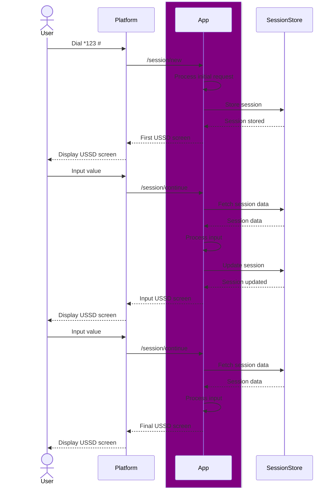
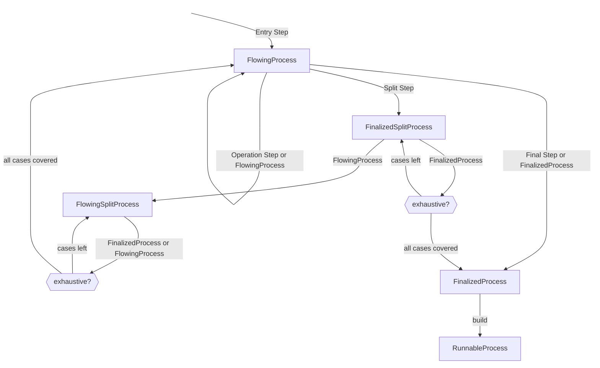

# Brrricks

## Brrricks app session flow

## Process builder states

## Plausible use cases

[Africa's Talking API Reference](https://developers.africastalking.com/docs/ussd/handle_sessions)

[Creditswitch API Reference](https://developers.creditswitch.com/pages/ussd)

[Qrios API Reference](https://deep.qrios.com/api/doc/developer-guide/sdk/ussd)

[//]: # (todo Redirect)

[//]: # (todo ReturnFromRedirect)

[//]: # (todo Back)

[//]: # (todo ConditionalBack)
