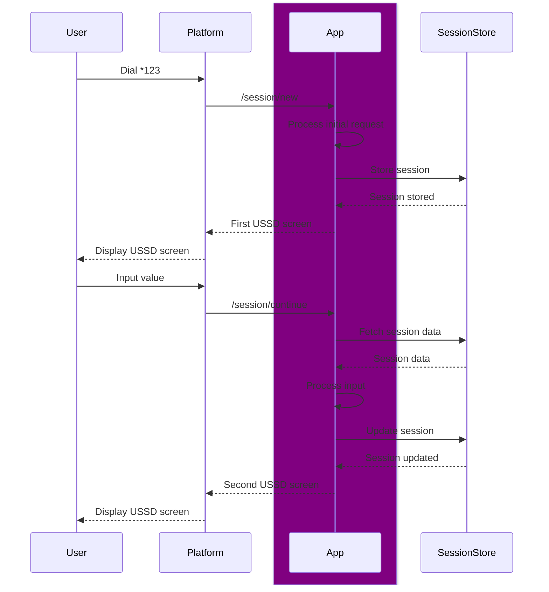

# Brrricks

## Process modelling

[Process builder state diagram](type_process_builder/src/process_builder_diagram.mermaid)

## Plausible use cases

[Africa's Talking API Reference](https://developers.africastalking.com/docs/ussd/handle_sessions)

[Creditswitch API Reference](https://developers.creditswitch.com/pages/ussd)

[Qrios API Reference](https://deep.qrios.com/api/doc/developer-guide/sdk/ussd)
