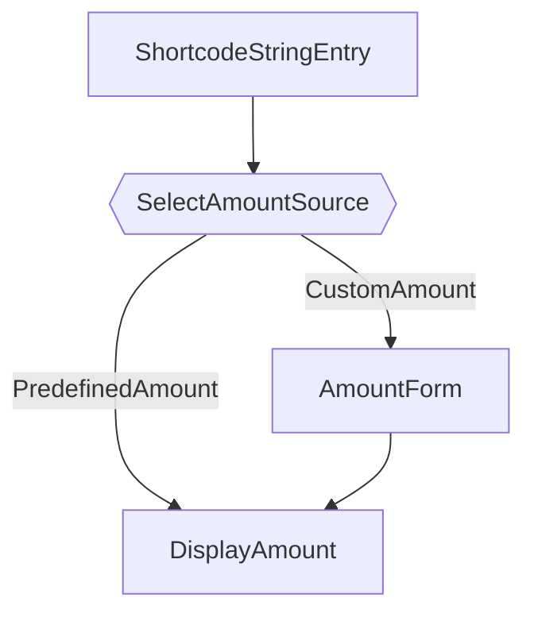
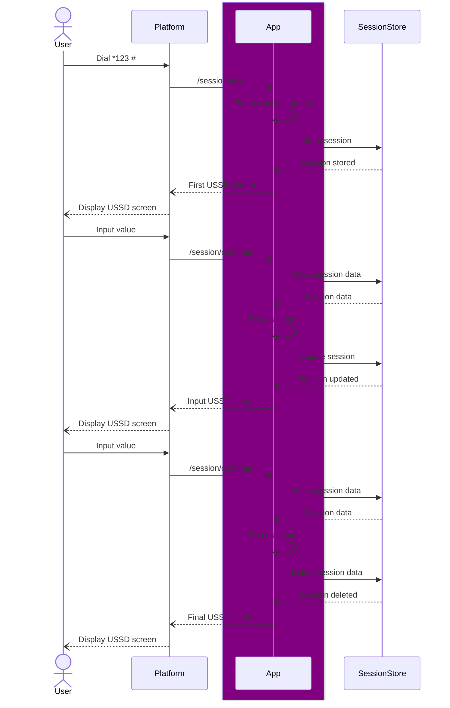
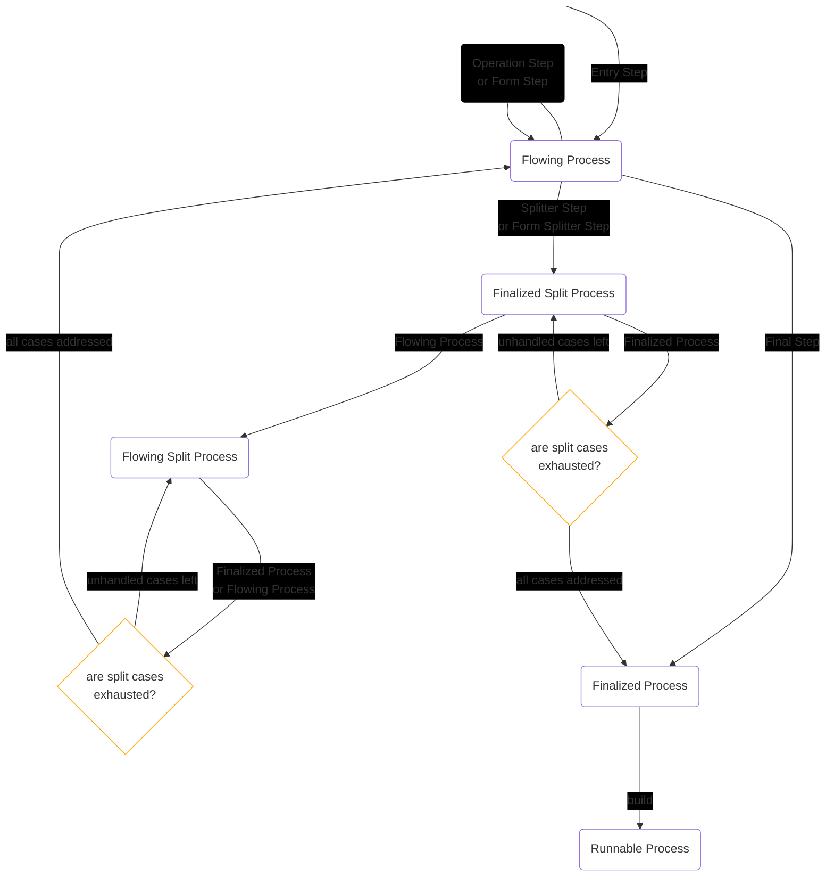

# Brrricks

Type-safe process modelling library

## Concepts

**Step** is a unit of execution. Each step belongs to one of the
[following archetypes](type_process_builder/src/step.rs): `Entry`, `Operation`, `Form`, `Splitter`, `FormSplitter`, or `Final`.

**Process** is a composition of steps with a defined execution order, including conditional branches and
early termination paths.

**Parameter** (param) is a value passed between steps and persisted across user interactions within the same session.

## Goals

Process implemented with this library has the following invariants enforced at **compile-time**:

- each step may only consume parameters that are known to be produced earlier in the process,
- all execution paths must terminate in a final step,
- every branch introduced by a split step must have a corresponding continuation defined,
- once a parameter is produced, its value cannot be overwritten in subsequent steps and consumed later.

## Example

The following flowchart illustrates an example process:


```mermaid
flowchart TD
    ShortcodeStringEntry --> SelectAmountSource{{SelectAmountSource}}
    SelectAmountSource -->|PredefinedAmount| DisplayAmount
    SelectAmountSource -->|CustomAmount| AmountForm
    AmountForm --> DisplayAmount
```

The process shown in the flowchart can be implemented using `Brrricks`:
<!-- EXAMPLE_START -->

```rust
mod standard_io_process_runner;

use crate::standard_io_process_runner::{Message, Messages, standard_io_process_runner};
use frunk_core::hlist::HNil;
use frunk_core::{Coprod, HList, hlist, hlist_pat};
use serde::{Deserialize, Serialize};
use serde_value::Value;
use type_process_builder::builder::*;
use type_process_builder::step::{Entry, FailedInputValidationAttempts, Final, Form, FormSplitter, InputValidation};
use typenum::*;

#[derive(Clone, Deserialize, Serialize)]
struct ShortcodeString(String);
impl ParamValue for ShortcodeString {
  type UID = U0;
}

#[derive(Clone, Deserialize, Serialize)]
struct Amount(u32);
impl ParamValue for Amount {
  type UID = U1;
}

struct ShortcodeStringEntry;
impl Entry for ShortcodeStringEntry {
  type Produces = HList![ShortcodeString];
  type Messages = Messages;

  async fn handle(
    &self,
    _consumes: Vec<(ParamUID, Value)>,
    shortcode_string: String,
  ) -> anyhow::Result<HList![ShortcodeString]> {
    Ok(hlist!(ShortcodeString(shortcode_string)))
  }
}

pub struct PredefinedAmount;
pub struct CustomAmount;
struct SelectAmountSource;
impl FormSplitter for SelectAmountSource {
  type CreateFormConsumes = HNil;
  type ValidateInputConsumes = HNil;
  type Produces = Coprod![(PredefinedAmount, HList![Amount]), (CustomAmount, HNil)];
  type Messages = Messages;

  async fn create_form(&self, _consumes: Self::CreateFormConsumes) -> anyhow::Result<Message> {
    Ok(Message("Enter 1 for 100 or 2 for custom amount ".into()))
  }

  async fn handle_input(
    &self,
    _consumes: Self::ValidateInputConsumes,
    user_input: String,
    _failed_input_validation_attempts: FailedInputValidationAttempts,
  ) -> anyhow::Result<InputValidation<Self::Produces, Messages>> {
    Ok(match user_input.as_str() {
      "1" => InputValidation::Successful(Self::Produces::inject((PredefinedAmount, hlist!(Amount(100))))),
      "2" => InputValidation::Successful(Self::Produces::inject((CustomAmount, HNil))),
      _ => InputValidation::Retry(Message("not 1 or 2".into())),
    })
  }
}

struct AmountForm;
impl Form for AmountForm {
  type CreateFormConsumes = HNil;
  type ValidateInputConsumes = HNil;
  type Produces = HList![Amount];
  type Messages = Messages;

  async fn create_form(&self, _consumes: Self::CreateFormConsumes) -> anyhow::Result<Message> {
    Ok(Message("Enter a number".into()))
  }

  async fn handle_input(
    &self,
    _consumes: Self::ValidateInputConsumes,
    user_input: String,
    _failed_input_validation_attempts: FailedInputValidationAttempts,
  ) -> anyhow::Result<InputValidation<Self::Produces, Messages>> {
    match user_input.parse::<u32>() {
      Ok(value) => Ok(InputValidation::Successful(hlist![Amount(value)])),
      Err(_) => Ok(InputValidation::Retry(Message("Invalid number".into()))),
    }
  }
}

struct DisplayAmount;
impl Final for DisplayAmount {
  type Consumes = HList![ShortcodeString, Amount];
  type FinalMessage = Message;

  async fn handle(&self, consumes: Self::Consumes) -> anyhow::Result<Message> {
    let hlist_pat!(_shortcode_string, amount) = consumes;
    Ok(Message(format!("The amount was: {}. Good bye!", amount.0)))
  }
}

#[tokio::main]
async fn main() -> std::io::Result<()> {
  let process = ShortcodeStringEntry
    .show_split(SelectAmountSource)
    .case_via(PredefinedAmount, |x| x)
    .case_via(CustomAmount, |x| x.show(AmountForm))
    .end(DisplayAmount)
    .build("demo_process", 0);
  standard_io_process_runner(process).await
}

```

<!-- EXAMPLE_END -->

To run the example process in your terminal, execute the following command:

```console
cargo run
```

## Brrricks app session flow


```mermaid
sequenceDiagram
    actor User
    participant Platform
    box Purple
        participant App
    end
    participant SessionStore
    User ->> Platform: Dial *123 #35;
    Platform ->> App: /session/new
    App ->> App: Process initial request
    App ->> SessionStore: Store session
    SessionStore --) App: Session stored
    App --) Platform: First USSD screen
    Platform --) User: Display USSD screen
    User ->> Platform: Input value
    Platform ->> App: /session/continue
    App ->> SessionStore: Fetch session data
    SessionStore --) App: Session data
    App ->> App: Process input
    App ->> SessionStore: Update session
    SessionStore --) App: Session updated
    App --) Platform: Input USSD screen
    Platform --) User: Display USSD screen
    User ->> Platform: Input value
    Platform ->> App: /session/continue
    App ->> SessionStore: Fetch session data
    SessionStore --) App: Session data
    App ->> App: Process input
    App ->> SessionStore: Delete session data
    SessionStore --) App: Session deleted
    App --) Platform: Final USSD screen
    Platform --) User: Display USSD screen
```

## Process builder states


```mermaid
%%{
  init: {
    'flowchart': {
      'defaultRenderer': 'tidy-tree'
    },
    'themeVariables': {
      'edgeLabelBackground': '#000000'
    }
  }
}%%
flowchart TD
    classDef default fill: transparent;
    classDef hidden display: none;
    classDef orangeNodeEdge stroke: orange;
    classDef noEdge stroke: transparent, fill: black;
    Start:::hidden
    FinalizedSplitProcessSubgraph:::hidden
    subgraph FinalizedSplitProcessSubgraph
        FinalizedSplitProcess(Finalized Split Process)
        finalized_split_cases_final{are split cases<br>exhausted?}:::orangeNodeEdge
    end
    FlowingSplitProcessSubgraph:::hidden
    subgraph FlowingSplitProcessSubgraph
        FlowingSplitProcess(Flowing Split Process)
        flowing_split_cases{are split cases<br>exhausted?}:::orangeNodeEdge
    end
    FinalizedProcess(Finalized Process) -- " build " --> RunnableProcess(Runnable Process)
    Start -- " Entry Step " --> FlowingProcess(Flowing Process)
    FlowingProcess -- " Final Step " --> FinalizedProcess
    FlowingProcess -- " Splitter Step<br>or Form Splitter Step " --> FinalizedSplitProcess
    Loop:::noEdge
    Loop(" Operation Step<br>or Form Step ") --- FlowingProcess
    Loop --> FlowingProcess
    FinalizedSplitProcess -- " Flowing Process " --> FlowingSplitProcess
    FinalizedSplitProcess -- " Finalized Process " --> finalized_split_cases_final
    finalized_split_cases_final -- " unhandled cases left " --> FinalizedSplitProcess
    finalized_split_cases_final -- " all cases addressed " --> FinalizedProcess
    FlowingSplitProcess -- " Finalized Process<br>or Flowing Process " --> flowing_split_cases
    flowing_split_cases -- " unhandled cases left " --> FlowingSplitProcess
    flowing_split_cases -- " all cases addressed " --> FlowingProcess
    Start ~~~ Loop
    click FlowingSplitProcess "https://github.com/Only1Loatheb/brrricks/blob/master/type_process_builder/src/builder/flowing_split_process.rs"
    click FlowingProcess "https://github.com/Only1Loatheb/brrricks/blob/master/type_process_builder/src/builder/flowing_process.rs"
    click FinalizedSplitProcess "https://github.com/Only1Loatheb/brrricks/blob/master/type_process_builder/src/builder/finalized_split_process.rs"
    click FinalizedProcess "https://github.com/Only1Loatheb/brrricks/blob/master/type_process_builder/src/builder/finalized_process.rs"
    click RunnableProcess "https://github.com/Only1Loatheb/brrricks/blob/master/type_process_builder/src/builder/runnable_process.rs"
```

## Plausible use cases

[Africa's Talking API Reference](https://developers.africastalking.com/docs/ussd/handle_sessions)

[Creditswitch API Reference](https://developers.creditswitch.com/pages/ussd)

[Qrios API Reference](https://deep.qrios.com/api/doc/developer-guide/sdk/ussd)

## Development setup

The following [xtask](https://github.com/matklad/cargo-xtask) installs [monk](https://github.com/daynin/monk) to handle git hooks and updates
autogenerated files.

Run `xtask` from repository root directory.

```shell
cargo xtask
```

[//]: # (todo Redirect)

[//]: # (todo ReturnFromRedirect)

[//]: # (todo Back)

[//]: # (todo ConditionalBack)
